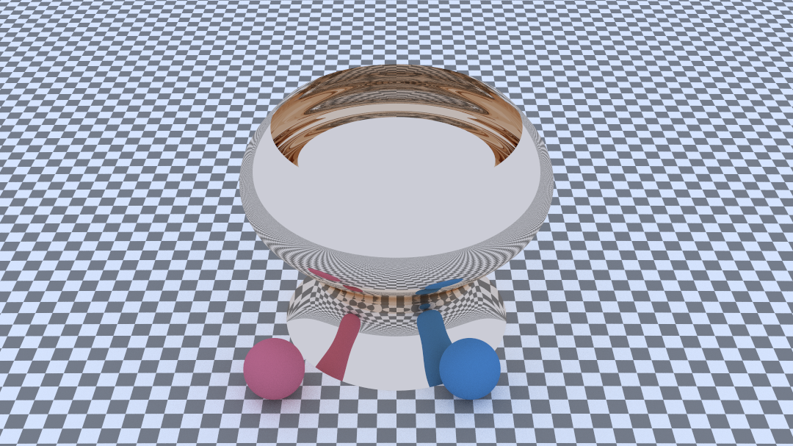

# 光线追踪报告

## 目录

[toc]

## 代码结构

```c++
bin // 可执行文件

meshes // 模型文件

output // 图片输出目录, 格式采用ppm

textures // 贴图文件

src // 代码目录
	external // 外部库
	material // 材质
	object // 物体
		hittable // 可求交物体
		curve // 曲线
	scene // 场景
	texture // 纹理
	unit // 除物体外的组件,如相机等
	util // 实用函数等
	main_multi_process.cc // 多进程加速的主函数(Linux)
	main.cc // 多线程加速的主函数

run_multi_process.sh
run.sh
run.bat // 以上为Windows或Linux下的执行代码
```


## 功能实现

### 综述

这次实现的光线追踪器采用路径追踪 (Path Tracing) 实现, 对于一个像素点, 从相机发出多条光线并追踪它们的运动, 根据这些光线的反射和折射情况给出这个像素的颜色.

光线追踪器实现了以下功能

- 基本光线追踪
  - 漫反射, 反射, 折射
  - 光源, 环境光
  - 软阴影
  - 抗锯齿
- 支持的物体
  - 球体, 平面, 三角形, 立方体等基本几何体
  - 三角网格
  - 旋转曲面 (支持网格求交和解析求交两种模式)
- 支持的对物体操作/效果
  - 任意平移, 旋转, 拉伸
  - 任意平移, 旋转, 拉伸运动 (用于运动模糊)
  - 烟雾化 (用于体积光或烟雾)
- 支持的相机效果
  - 景深
  - 运动模糊
- 支持的加速
  - bvh求交加速 (用于复杂网格和大量物体求交)
  - Windows下多线程加速
  - Linux下多进程加速


### 基本算法

路径追踪每次从像素点发出多条光线, 递归的追踪它们的运动并算出像素的颜色

- 抗锯齿

因为每次在像素点中随机取多条光线, 路径追踪可以天然的支持抗锯齿

- 软阴影

因为路径追踪跟踪一条光线的多次漫反射, 因此亦可以天然的支持软阴影

- 折射, 反射

利用相关的物理定律实现, 代码位于 `util/algebra/vec3.h:120`


### 可求交物体

可求交物体的虚基类如下

```c++
struct hit_record {
    point3 p;
    vec3 normal;
    shared_ptr<material> mat_ptr;
    double t;
    double u;
    double v;
    bool front_face;
};

class hittable {
public:
virtual bool hit( // 实现物体的求交算法
    const ray& r, double t_min, double t_max, hit_record& rec) const = 0;
virtual bool bounding_box( // 返回物体的包围盒
    double time0, double time1, aabb& output_box) const = 0;
};
```


#### 基本几何体

基本几何体的求交算法和包围盒算法都较为简单, 这里不再赘述, 代码位于

- 球体: `object/hittable/sphere.h`
- 平面: `object/hittable/plane.h`
- 方形: `object/hittable/arrect.h`
- 立方体: `object/hittable/box.h`


#### 三角形与三角网格

代码位于

- 三角形: `object/hittable/triangle.h`
- 三角网格: `object/hittable/mesh.h`

三角网格被简单的实现为了用bvh包裹的三角形集合, 这里只讨论三角形的实现

三角形记录三个顶点的坐标, 顶点法向, 顶点的贴图坐标, 并通过两个 `bool` 型变量决定是否使用顶点法向和贴图坐标

三角形求交采用 Möller-Trumbore 算法

在求交的同时可以求出交点的重心坐标, 若使用顶点法向, 则使用重心坐标对顶点法向进行平均, 否则法向取三角形本身的法向

贴图坐标同样可以由三个顶点的贴图坐标平均而来


#### 旋转曲面

代码位于

- 旋转曲面: `object/hittable/surface_rev.h`
- 曲线: `object/curve/`

旋转曲面可以生成任何曲线的可求交物体, 但要求曲线实现一些函数


**曲线**

曲线的虚基类如下

```c++
struct curvePoint {
    point3 v; // point
    vec3 dir; // unit direction
    double t; // parameter
};

class curve {
public:
    virtual point3 getPoint(double t) const = 0; // param -> point
    virtual vec3 getDir(double t) const = 0; // param -> direction
    virtual void discretize( // 离散化曲线, 返回resolution个点
        int resolution, std::vector<curvePoint>& data) = 0;
    virtual bool hit_if_rec( // 若形成旋转曲面, 光线与曲面的交点
        const ray &r, double &t, double &t1, double max_dt) = 0;
};
```

其中 `discretize` 函数用于创建旋转曲面的网格

`hit_if_rec` 求得光线到 y 轴的距离等于曲线到 y 轴的距离处的点在曲线上的坐标和在光线上的坐标

由于时间限制, 这里仅实现了 bezier 曲线, 下面叙述 bezier 曲线的实现方式

事实上, bazier 曲线的坐标关于 `t` 均为多项式, 定义 bezier 曲线时, 使用递归算法求出多项式的各项, 查询点和方向时, 计算多项式仅需 `O(n)` 的时间

`discretize` 采用 De Casteljau 算法

`hit_if_rec` 采用多元函数 Newton 法, 事实上, 求交相当于求如下方程组
$$
\begin{cases}
f(t,t')=py+dy\,t'-y(t)=0\\
g(t, t')=(px+dx\,t')^2+(pz+dz\,t')^2-x^2(t)=0
\end{cases}
$$
这里设光线为 $(px, py, pz)+(dx,dy,dz)t'$, 曲线为 $(x(t),y(t))$

这两个函数的函数值和各个偏导均易求出, 这样就可以使用多元函数 Newton 法
$$
\begin{pmatrix}t_{n+1}\\t'_{n+1}\end{pmatrix}=\begin{pmatrix}t_{n}\\t'_{n}\end{pmatrix}-J^{-1}(t_n, t'_n)\begin{pmatrix}f(t_{n},t'_n)\\g(t_n,t'_{n})\end{pmatrix}
$$
这里 $J$ 是雅可比矩阵

Newton 法的实现在 `util/newton.h`

这个方法不太稳定, 所以需要比较好的初始值, 这部分可以参考旋转曲面的实现


**旋转曲面**

重要变量如下

```c++
class surface_rev : public hittable {
public:
    virtual bool hit(const ray& r, double t_min, double t_max, hit_record& rec) const override;
    virtual bool bounding_box(double time0, double time1, aabb& output_box) const override;

public:
    shared_ptr<curve> cv;
    shared_ptr<material> mat_ptr;
    
    // in_mesh is in the surface, out_mesh is out of it
    shared_ptr<hittable> in_mesh;
    shared_ptr<hittable> out_mesh;

    bool use_mesh;
    int resolution;
};
```

若 `use_mesh==true`, 调用构造函数的时候会建立 `in_mesh`, `hit` 和`bounding_box` 均直接调用建立的网格的相应函数

若 `use_mesh==false` 参数曲面会尝试求出精确的交点和法向

在调用构造函数的时候, 会建立两个网格 `in_mesh` 和 `out_mesh`, 其中 `in_mesh` 完全在参数曲面以内, `out_mesh` 完全在参数曲面以外, 参数曲面应该恰好处于两个网格之间

在求交时, 先求光线与两个曲面的交点, 根据相交情况的不同选取不同的初始值并调用曲线的 `hit_if_rec` 函数求出精确的交点和法向

在这种情况下, 需要的网格大小一般远远小于仅使用网格就能取得很好的效果, 而且因为已经由网格求出了比较精确的初始值, 求精确交点所需的额外开销并不大, 相比仅使用网格渲染时间的增加一般小于30%


### 对可求交物体的操作/效果

#### 平移, 旋转, 拉伸

代码位于 `object/hittable/transform.h`


`transfrom` 类接受一个 4*4 的矩阵和一个初始可求交物体, 对外表现就如同初始可求交物体经过矩阵变换之后的行为

`hit` 首先对光线进行逆变换, 使用逆变换之后的光线与物体求交, 并将求出的交点与法向变换为正确的状态

`bounding_box` 对原物体的包围盒进行变换, 并返回正确的包围盒


#### 运动

代码位于 `object/hittable/motion.h`


`motion` 类接受一个(接受时间, 返回 4*4 矩阵的运动函数)和一个初始可求交物体, 对外表现就如同物体如运动函数描述的一样运动

`hit` 根据光线的发出时间, 生成对应的 `transform` 类, 并调用 `transform` 类的 `hit` 函数求出结果

`bounding_box` 由外部传入, 由运动函数计算出包围盒本身不难, 但计算量较大, 这里就没有实现


#### 烟雾/体积光

代码位于 `object/hittable/medium.h`


采用每单位距离光线等概率散射的模型, 散射之后的光线会继续求交, 因此一条光线可能在烟雾内散射多次, 由此模拟现实的烟雾效果


### 相机效果

代码位于 `unit/camera.h`

#### 景深

等效实际相机成像的过程, 定义光圈与焦距

生成光线时, 光线的起点在光圈的范围内随机


#### 运动模糊

模拟实际相机成像, 定义曝光时间

生成光线时, 光线的发出时间在曝光时间内随机

物体根据光线的时间计算其当前的位置


### 加速

#### bvh

代码位于 `object/hittable/bvh.h`

将物体建成一颗二叉树, 每层选一个轴, 将所有的物体按这个轴排序并分成两半, 分别放入两个子节点中

这样, 求交的时候就可以先判断是否与整个左节点或右节点相交, 可以极大的加速存在多个物体的求交


#### 多线程/多进程

在windows下采用openMP进行多线程加速

但是经过测试, openMP在Linux下表现不佳, 因此在Linux下使用 `fork` 创建多进程进行加速


## 结果


本图包含: 贴图, 运动模糊, 折射, 反射, bvh加速



本图为解析法求参数曲面


康奈尔盒子, 可以看到 color blooding 现象


烟雾


花瓶, 没有找到高分辨率的贴图, 所以看起来贴图非常糊


带有景深, 镜面, 折射


复杂网格模型, 中间那块看起来奇怪的部分是两次反射成像的结果, 因为这个参数曲面是凹进去的, 因此上下表面都可以成像